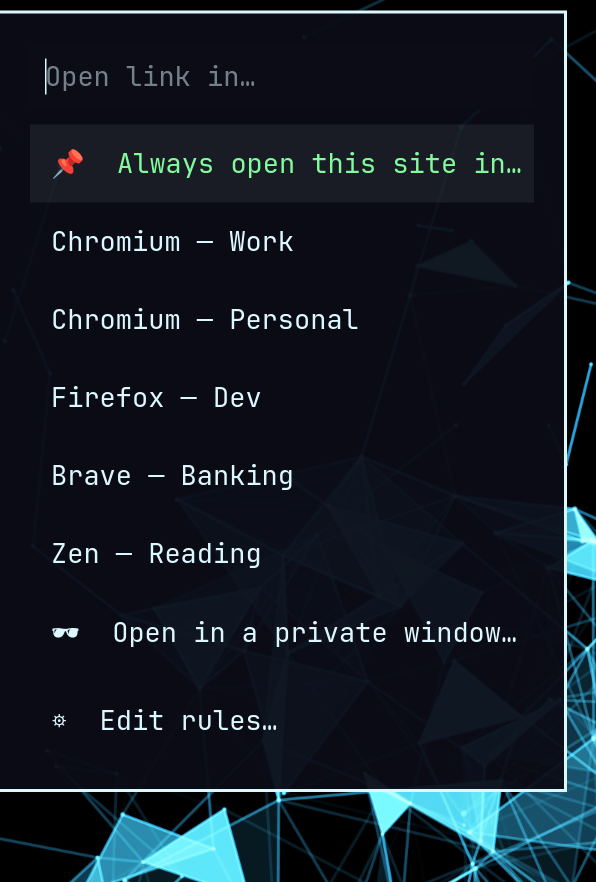
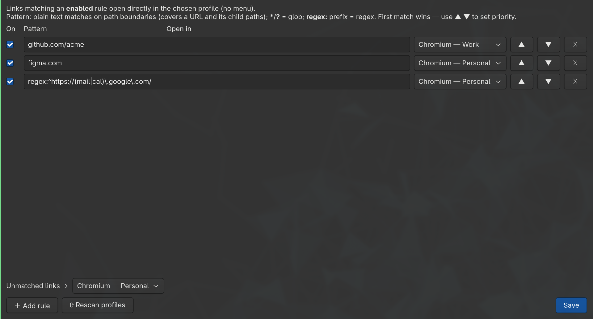

# browser-better-default

A Linux default-browser replacement that pops up a **menu of every browser + profile**
each time you open a link — with **smart-default rules** so chosen sites skip the menu and
open directly in the right profile.

Built for [omarchy](https://omarchy.org) / Hyprland + [walker](https://github.com/abenz1267/walker),
with a `BROWSER_PICKER_MENU` escape hatch for other `dmenu`-style menus.


<p align="center">
  
  &nbsp;&nbsp;
  
</p>

<p align="center"><em>Left: pick a browser + profile per link. Right: smart-default rules editor.</em></p>

## Why

If you keep several browsers and many profiles (work, personal, clients, AI accounts…),
a single "default browser" is the wrong model. browser-picker lets you decide *per link*,
and remembers the decisions you want to make permanent.

## Features

- **Picker on every link** — choose browser + profile from a menu (`walker --dmenu` by default, or your `BROWSER_PICKER_MENU`).
- **Smart defaults** — rules like `github.com/myorg/myrepo → Chromium (Work)` open
  directly, no menu. Plain text matches on **path/host boundaries** (covers a URL *and its
  child paths*, but `…/repo` won't match `…/repo-staging`); `*`/`?` = glob; `regex:` prefix
  = full regex. First match wins.
- **In-flow rule creation** — pick *📌 Always open this site in…* from the menu and a GTK
  editor opens **pre-filled** from the current URL; trim the scope, pick a profile, Save.
- **Learns your habits** — repeat a profile for a site and the picker grows explicit
  `⭐ scope → profile` shortcuts at the top (see below). Fully **local & offline**.
- **Private/incognito** — every profile also appears as a *🕶 Private* twin in the menu
  (regular profiles first, private ones below), so one pick opens it in a private window
  (`--incognito` / `--private-window` chosen per browser family).
- **Default for unmatched links** — optionally route everything that matches no rule to a
  chosen profile (a catch-all), instead of always showing the menu.
- **GTK rules editor** — enable/disable, edit patterns, reorder priority (▲▼), set the
  default, **⟳ Rescan profiles** to auto-detect browsers, and ⚠ warnings for rules that
  point at a renamed/missing profile.
- **Routes** `http`, `https`, and `mailto`.

## Install

```sh
git clone https://github.com/dataforxyz/browser-better-default
cd browser-better-default
./install.sh
```

`install.sh` symlinks the executables into `~/.local/bin`, installs the `.desktop`
launchers, seeds `~/.config/browser-picker/` from the examples (without overwriting an
existing config), and registers the picker as the default web/link handler for `http`,
`https`, and `mailto`.

> Ensure `~/.local/bin` is on your `PATH`. Because the install uses symlinks, keep the clone
> around (or reinstall from the new location if you move it).

### What the installer changes

Core install only touches user-level files:

- `~/.local/bin/browser-picker*` symlinks (replaces same-name files/symlinks)
- `~/.local/share/applications/browser-picker*.desktop` (regenerated on each install)
- `~/.config/browser-picker/{browsers.conf,rules.conf}` if missing
- XDG default handlers for `http`, `https`, and `mailto`

It does **not** require `sudo` and it does **not** install the Chromium web-app bridge by
default. Restore automation that wants the bridge can run `./install.sh --with-bridge` or
set `BROWSER_PICKER_INSTALL_BRIDGE=1`. See
[docs/BRIDGE.md](docs/BRIDGE.md) before opting into that extra step.

### Requirements

- [walker](https://github.com/abenz1267/walker) preferred (uses omarchy's
  `omarchy-launch-walker` if present, else `walker --dmenu`). Other menus can be wired with
  `BROWSER_PICKER_MENU`, for example:

  ```sh
  export BROWSER_PICKER_MENU='wofi --dmenu --prompt "$BROWSER_PICKER_PROMPT"'
  ```

- Python 3 + PyGObject (GTK 4) for the rules editor (`python-gobject` on Arch).
- `xdg-utils`, `util-linux` (`setsid`).

## Configuration

Two files in `~/.config/browser-picker/`:

- **`browsers.conf`** — `Label|||command` per line. Auto-fill with *Rescan profiles*.
- **`rules.conf`** — `enabled|||pattern|||label[|||private]` per line (optional 4th field
  `1` opens matching links in a private window). Managed by the editor.

Both are read fresh on every link click — no daemon, no restart.

See **[docs/CONFIGURATION.md](docs/CONFIGURATION.md)** for the full reference: pattern
syntax (plain / glob / `regex:` / catch-all), the editor, profile detection, menu selection,
uninstall/revert steps, and troubleshooting.

## How it works

`browser-picker` is registered as the handler for web/mailto links. On each link it checks
`rules.conf` for the first enabled match and launches that profile directly; otherwise it
shows the menu. Profiles are launched detached via `setsid`.

Profile detection reads Chromium-family `Local State` (`profile.info_cache`) and
Firefox-family `profiles.ini`.

## Optional Chromium / omarchy web-app bridge

Chromium `--app=` windows (including omarchy web apps) can open clicked links internally,
bypassing the system default browser. If you want those links to go through browser-picker
as well, opt into the bridge during install:

```sh
./install.sh --with-bridge
```

You can also run `extension/install-bridge.sh` directly after a core install. Read
**[docs/BRIDGE.md](docs/BRIDGE.md)** first. The bridge installs a native-messaging host
and auto-loads a small local Chromium extension by editing user-level browser flags files;
this is intentionally opt-in because it grants the extension broad navigation permissions
and logs diverted app-window URLs locally for debugging.

## Privacy and safety

- No network calls, telemetry, API keys, or remote services.
- Your profile list and rules live under `~/.config/browser-picker/`.
- The local recommender stores up to 1000 recently picked `http(s)` URLs in
  `~/.config/browser-picker/history.json`. Delete that file any time to reset learning.
- The optional web-app bridge writes diagnostics, including app-window link URLs, to
  `~/.cache/browser-picker/bridge.log`. Delete that file any time.
- `browsers.conf` commands are local shell command snippets. Do not paste browser-picker
  config from people you do not trust.

## Learns your habits

`browser-picker` quietly notes which profile you manually pick for which link (including
private-window picks, tracked separately; never links already auto-routed by a rule). Once
you've opened a similar place in the same profile a couple of times, the **next** time you
open a matching link the picker shows one-click default shortcuts near the top, with the rule
scope front-loaded so it is clear what will be saved:

```
⭐  github.com/myorg → Chromium — Work
⭐  github.com/myorg/myrepo → Chromium — Work
```

Pick it and the link opens in that profile **and** the rule is written, so it auto-routes from
then on. No second popup, no extra step — pick a normal profile instead and it just opens (and
keeps learning). It **generalizes across URLs** rather than memorizing one address, suggesting
the broadest pattern owned by a *dominant* profile (one stray pick with another profile won't
veto an obvious habit; a genuine 50/50 tie stays quiet):

| What you opened (same profile)                          | Shortcut creates  |
| ------------------------------------------------------- | ----------------- |
| the same repo, repeatedly                               | `github.com/org/repo` |
| a few repos under one org                               | `github.com/org`  |
| a few orgs on a host you only use with one profile      | `github.com`      |

Picks made in a **private/incognito** window are learned separately: repeat one and the
shortcut offers a *private* default (e.g. *⭐ open in Brave 🕶 Private*), which writes a rule
that always opens that scope in a private window. Normal and private habits never mix.

The **menu itself is smart-ordered**: the profile you're most likely to want for *this* link
(by host/path affinity, then overall use) is the **first** item, any `⭐ scope → profile`
shortcuts follow it, and the rest of your profiles follow most-used-first; the manual
*📌 Always open…* and *⚙ Edit rules…* sit at the end. (Ordering controls what's surfaced
first; once you start typing, your menu program does its own fuzzy ranking.)

This is a **local recommender** (`browser-picker-recommend`) — no network, no API keys, no
LLM; your URLs never leave the machine. History lives in
`~/.config/browser-picker/history.json`. The shortcut appears on the **1st repeat** (the 2nd
matching open) by default; raise it with `threshold=N` in
`~/.config/browser-picker/settings.conf` (or the `BROWSER_PICKER_SUGGEST_THRESHOLD` env var),
minimum `2`.

## Notes / limitations

- Firefox & Zen open one profile at a time — opening a link in a profile while a *different*
  profile of the same browser is running may defer to the running instance (a browser
  limitation, not this tool). Chromium-family handle concurrent profiles fine.
- *Rescan* only **adds** newly found profiles; it won't delete entries you've removed by
  hand (so custom entries like a bare `Brave` survive).

## Development

```sh
bash tests/run.sh   # shellcheck + bash syntax + py_compile + unit tests
```

- `tests/test_matching.sh` — `matches()` (boundary/glob/regex) and `private_flag()`.
- `tests/test_rules.py` — `default_pattern`, `normcmd`, `model_items`, `load_rules`.
- `tests/test_recommend.py` — local recommender pattern, ranking, private-mode, and rule-writing logic.

CI runs the same suite on every push/PR (see `.github/workflows/ci.yml`).

## License

MIT — see [LICENSE](LICENSE).
